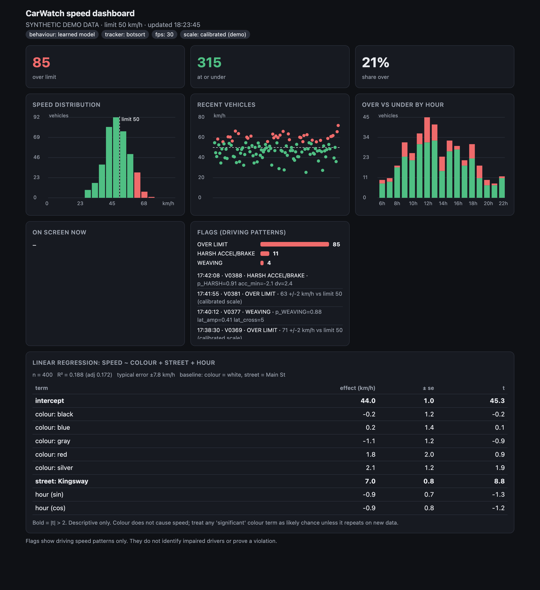
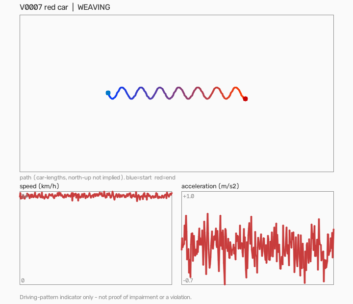
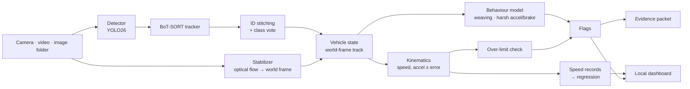

<div align="center">

# 🚗 CarWatch

**Real-time vehicle tracking and driving-pattern analysis from an iPhone, a dashcam-style camera, or a drone.**
Detection → tracking → camera-motion cancellation → speed & acceleration with error bars → learned behaviour flags → evidence packets → live local dashboard.




<sub>The live dashboard (localhost only). **All images in this README are generated from synthetic data.**</sub>

</div>

> [!IMPORTANT]
> **CarWatch flags driving *patterns* (weaving, harsh braking, speed). It does not detect drunk or impaired drivers, and a flag does not prove a violation.** Impairment can only be established by a person with the proper authority. Every flag is a "worth a closer look", logged with the numbers that caused it.

---

## Why it's interesting

Most "AI traffic" demos stop at drawing boxes. CarWatch tries to be *measurable and honest*:

| | |
|---|---|
| 🎯 **Speed & acceleration with error bars** | A quadratic fit over the last 2 s gives speed and acceleration, and its covariance gives a 1σ error, so a noisy track reports a wide error instead of a confident wrong number. |
| 📐 **Real metres, when you give it a scale** | Click 4 road points of known size → homography → true km/h. Without calibration every number is labelled `est`. |
| 🧭 **Works from a shaking phone or drifting drone** | Background optical flow cancels camera motion; trajectories live in a fixed world frame. |
| 🧠 **Behaviour model trained on real tracks** | Gradient-boosted classifiers on 12 trajectory features, trained on real vehicle tracks with *injected* weaving/braking, and tested leave-one-sequence-out. Rules false-alarmed on 54 % of normal real windows; the learned model on ~12 %. |
| 🛡️ **Physics gate** | Acceleration no road vehicle can reach (> ~2.7 g) is treated as a tracker glitch, never a flag. |
| 🧾 **Explainable flags** | Every flag logs the exact feature values and probability behind it. |
| 🎞️ **Evidence packets** | Per flag: a clip from 5 s before to 5 s after, trajectory/speed/acceleration plots, the metrics as JSON, and a one-page summary. |
| 📊 **Live dashboard + regression** | Over/under counts, speed distribution, flags with evidence links, and a linear regression of speed on colour, street and hour **with standard errors and a "this is probably chance" warning**. |
| 🔒 **Private by default** | No face recognition, no plate reading, no cloud calls. The dashboard binds to `127.0.0.1`. Footage is only written if you ask (`--evidence`, `--save`). |

<div align="center">


<sub>The plot inside an evidence packet (synthetic weaving example).</sub>
</div>

---

## How it works



1. **Detection.** `yolo26s` (COCO car / van / truck / bus / motorcycle) for street view; `yolo26s-obb` (oriented boxes, DOTA small/large vehicle) for overhead view. Classes are picked *by name*, so COCO, fine-tuned VisDrone, or DOTA weights all work.
2. **Tracking.** Ultralytics BoT-SORT (default) or ByteTrack. A stitching layer merges an ID that vanishes and reappears within 1 s and 0.6 car-lengths, and class labels are a majority vote (no car↔truck flicker).
3. **Stabilization.** Sparse optical flow on the background (vehicle boxes masked) → partial affine → cumulative transform into a fixed world frame. Trajectories are stored in world coordinates and drawn back in frame coordinates.
4. **Kinematics.** Along-track distance over the last ~2 s is fit with `s(t) = c0 + c1·t + c2·t²`: speed = `c1`, acceleration = `2·c2`, errors from the fit covariance. Scale comes from, in order: a calibration homography, `--ppm`, or a 4.5 m car-length guess (shown as `est`).
5. **Behaviour.** Per 3 s window, 12 scale-invariant features (lateral residual after a **cubic** detrend, so turns and single lane changes are absorbed; dominant oscillation frequency; acceleration percentiles; speed change; straightness…). Two `HistGradientBoosting` classifiers output P(weaving) and P(harsh accel/brake). A flag needs 8 consecutive positive evaluations. The original hand-set rules remain as `--rules`.
6. **Records & dashboard.** One record per vehicle (median moving speed, colour, type, street, hour, over/under). They append to a local history CSV and feed an OLS regression and the live page.

---

## Measured, not claimed

Everything below is reproducible from this repo (see [Reproduce](#reproduce-the-numbers)). Read the caveats: they matter more than the numbers.

### Tracking: VisDrone2019-VID-val, vehicles only (6 sequences)

Detector `yolo26s` (COCO weights), `imgsz` 1280, conf 0.25. MOTA/IDF1 at IoU 0.5 via `motmetrics`; HOTA is the mean over IoU 0.05–0.95 from [`eval/hota.py`](eval/hota.py) (own implementation of the TrackEval algorithm, unit-tested; averaged over sequences).

| Tracker | HOTA | DetA | AssA | MOTA | IDF1 | ID switches | FPS (M2 Pro) |
|---|---|---|---|---|---|---|---|
| ByteTrack | 0.482 | 0.422 | 0.573 | 0.388 | 0.557 | 329 | 18.1 |
| **BoT-SORT** (default) | **0.543** | **0.444** | **0.679** | **0.405** | **0.643** | **104** | 11.7 |
| BoT-SORT + ReID | 0.540 | 0.440 | 0.678 | 0.390 | 0.643 | 144 | 7.0 |

BoT-SORT cuts ID switches by ~⅔ versus ByteTrack; ReID adds cost and no gain. **Detection is the bottleneck** (DetA 0.44): the general COCO detector misses many small aerial vehicles.

### Behaviour flags on real tracks (leave-one-sequence-out)

Real VisDrone ground-truth tracks (stabilized) are used as *normal traffic*; weaving and hard braking are **injected** with known labels. Each fold trains on 5 sequences and tests on the 6th. 1,009 clean windows, 1,009 injected weaves, 534 injected brake/accel events.

| Method | Weave recall | Weave false alarms | Harsh recall | Harsh false alarms |
|---|---|---|---|---|
| Hand-set rules | 0.980 | 0.114 | 0.978 | **0.542** |
| Learned, synthetic data only | 0.996 | 0.102 | 0.723 | 0.351 |
| Learned, real tracks + injection | 0.975 | **0.044** | 0.848 | 0.154 |
| Learned, real + synthetic (shipped recipe) | 0.978 | 0.047 | 0.826 | **0.116** |

> [!WARNING]
> **These are not real-world accuracy figures.** The injected events are still *my* definition of weaving and braking; ground-truth tracks are smoother than detector output (jitter was added); "clean" windows may contain real events, so false-alarm rates are upper bounds. There are **no labelled real driving events yet**. Producing them is the next milestone.

### A negative result: sliced inference (SAHI-style) doesn't help yet

| Mode (conf 0.25) | Recall | Precision | F1 | s/frame |
|---|---|---|---|---|
| Full frame, 1280 px | 0.615 | 0.682 | **0.646** | **0.03** |
| 640 px tiles + full frame | 0.724 | 0.469 | 0.569 | 0.44 |

Slicing finds more vehicles but adds more false detections with a COCO model, and is ~15× slower. It's implemented ([`slicing.py`](slicing.py)) but deliberately **not** wired in as `--slice`; fine-tuning the detector comes first.

### What is *not* proven

- ❌ km/h accuracy: needs a drive-past of a car at a known speed on a calibrated scene.
- ❌ Flag precision/recall on real labelled events.
- ❌ The aerial oriented-box path on real overhead footage.
- ❌ Anything about impairment. CarWatch doesn't try.

---

## Quick start

```bash
git clone https://github.com/Bardmalek/carwatch && cd carwatch
python3.12 -m venv .venv && source .venv/bin/activate
pip install -r requirements.txt

python eval/train_behaviour.py                      # trains the behaviour model on synthetic data (~1 min, no downloads)
python dashboard.py --demo --out demo.html && open demo.html   # see the dashboard with no footage

python carwatch.py --list-cameras                   # find your camera (iPhone via Continuity Camera shows up as an index)
python carwatch.py --dashboard --print-speeds --street "Main St" --speed-limit 50
```

The first run downloads `yolo26s.pt` from Ultralytics. Without a trained behaviour model CarWatch falls back to the threshold rules and tells you so. `device` is auto-selected (`mps` on Apple Silicon, `cuda`, else CPU).

```bash
python carwatch.py --source clip.mp4 --save out.mp4                 # a video file
python carwatch.py --source path/to/jpg_folder --view aerial        # overhead footage / image sequence
python carwatch.py --source 1 --evidence --dashboard                # iPhone, with evidence packets + dashboard
```

**Keys:** `L` draw counting line · `C` clear · `T` trails · `P` pause · `S` screenshot · `E` export CSV · `Q` quit

### Real km/h: calibrate a scene

```bash
python calibration.py --source clip.mp4 --width 3.6 --length 12 --out scene.json
python carwatch.py --source clip.mp4 --calib scene.json
```

Click the four corners of a road rectangle whose size you know (e.g. one lane 3.6 m wide × 12 m long), in the order near-left, near-right, far-right, far-left. Points are in first-frame pixels, which the stabilizer keeps valid as the camera moves. Calibration is only valid for things on the road plane; in street view a box centre sits above the road, which biases speed in a way the error estimate does not include.

<details>
<summary><b>All command-line options</b></summary>

| Option | Meaning |
|---|---|
| `--source` | camera index (default `0`), video, RTSP URL, or image folder |
| `--view {street,aerial}` | detector family (COCO boxes vs. oriented overhead boxes) |
| `--model`, `--imgsz`, `--conf`, `--device` | detector weights, inference size, confidence, device |
| `--tracker {botsort,bytetrack}` | tracker (default `botsort`) |
| `--rules` | use the hand-set thresholds instead of the learned behaviour model |
| `--speed-limit` | km/h (default 50) |
| `--calib scene.json` / `--ppm` | true scale from a calibration / pixels-per-metre |
| `--street`, `--start-time`, `--history` | metadata and history file for speed records |
| `--dashboard`, `--port` | live dashboard on `127.0.0.1` (default 8765) |
| `--print-speeds` | print every moving car's speed/acceleration once a second |
| `--evidence`, `--evidence-dir` | save an evidence packet per flag (stores footage locally) |
| `--save out.mp4` | write the annotated video |
| `--headless`, `--max-frames` | no window; stop after N frames |
| `--no-stabilize` | disable camera-motion compensation |

</details>

---

## Reproduce the numbers

```bash
pip install -r requirements-dev.txt
python -m pytest tests -q                           # 39 tests, no downloads or footage needed (7 that use the
                                                    # behaviour model skip until you run eval/train_behaviour.py)
```

The tests cover: behaviour flags on synthetic scenarios (straight, weave, hard brake, lane change, turn, gentle stop) with and without detector jitter, kinematics recovery and honest error bars, calibration to true metres, HOTA sanity cases, evidence packets, the dashboard's regression and its localhost-only evidence route (path traversal returns 404).

For the VisDrone evaluations, download **VisDrone2019-VID-val** from the [official repository](https://github.com/VisDrone/VisDrone-Dataset) and place it at `~/Downloads/VisDrone2019-VID-val/`:

```bash
python eval/visdrone_mot.py                         # tracker comparison → eval/RESULTS.md
python eval/real_augment.py                         # real-track behaviour test → eval/REAL_RESULTS.md
python eval/slice_recall.py --every 15              # sliced inference → eval/SLICE_RESULTS.md
python eval/real_augment.py --ship                  # retrain the shipped model on real + synthetic
```

Result tables from the runs described above are committed in [`eval/`](eval/).

---

## Repository layout

```
carwatch.py            entry point: capture → detect → track → stabilize → analyse → output
kinematics.py          speed/acceleration + error bars from a track window
behaviour_ml.py        features, classifiers, synthetic + real-track event injection
calibration.py         pixels → metres homography tool
appearance.py          vehicle colour naming
speedlog.py            per-vehicle records, history CSV, linear regression
dashboard.py           local live dashboard + standalone HTML report (make_chart)
evidence.py            evidence packets (clip, plots, JSON, summary page)
slicing.py             tiled inference + class-aware NMS
eval/                  tracker eval (HOTA, MOTA, IDF1), real-track + synthetic behaviour eval, slicing eval
tests/                 synthetic scenario generator and the regression suite
docs/                  README images (synthetic data)
```

## Roadmap

- [x] Synthetic regression suite; tracker comparison with HOTA; real-track behaviour evaluation
- [x] Calibration → true km/h; speed/acceleration with error bars; evidence packets; live dashboard
- [ ] **Labelling loop**: review each flagged clip ("real" / "false alarm") and retrain on it
- [ ] **Real-car speed validation** on a calibrated scene
- [ ] Fine-tune the detector on aerial vehicles, then re-test slicing
- [ ] Calibrated probabilities / conformal prediction so flags carry a bounded false-alarm rate
- [ ] Lane polygons and rule modules that need no signal input (wrong-way, stopped in intersection)

---

## Privacy & responsible use

- **No face recognition. No licence-plate reading.** Nothing is sent to third-party services; the dashboard and evidence files are served only to `127.0.0.1`.
- Footage is only stored when you opt in (`--evidence`, `--save`).
- Colour is recorded only as a coarse paint-colour word for labelling. The regression on colour is **descriptive**: colour doesn't cause speed, and any "significant" colour effect should be treated as chance until it repeats on new data.
- Flags describe driving *patterns*. Treat them as prompts for human review, never as findings. Check the law and policy where you film.

## Licences, data & references

- **Code:** [AGPL-3.0](LICENSE). CarWatch builds on [Ultralytics](https://github.com/ultralytics/ultralytics) (AGPL-3.0), including its YOLO26 weights and trackers.
- **No dataset content is in this repo**: no VisDrone images, annotations, or trained weights. VisDrone ([Zhu et al., *Detection and Tracking Meet Drones Challenge*, IEEE TPAMI 2021](https://arxiv.org/abs/2001.06303), AISKYEYE, Tianjin University) is used for evaluation only. Third-party mirrors describe it as CC BY-NC-SA 3.0 (non-commercial); check with the authors before any commercial use of models trained on it.
- **Methods:** BoT-SORT (Aharon et al., 2022), ByteTrack (Zhang et al., ECCV 2022), HOTA (Luiten et al., IJCV 2021).

<div align="center">

Built by **Bardia Malackzadeh** ([@Bardmalek](https://github.com/Bardmalek)) · Computing Science, SFU

</div>
